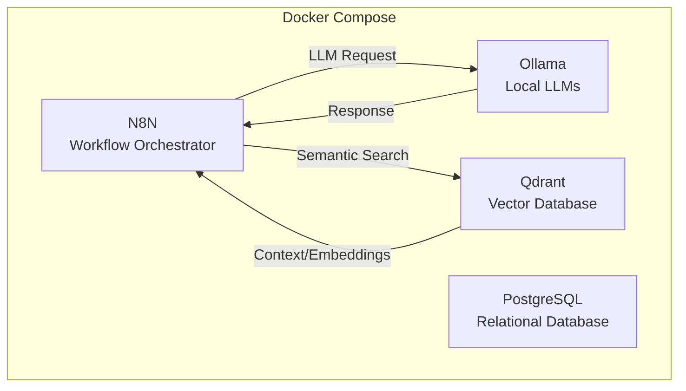

```mermaid
flowchart TB
    subgraph Docker Compose
        N8N[N8N\nWorkflow Orchestrator] 
        Ollama[Ollama\nLocal LLMs]
        Qdrant[Qdrant\nVector Database]
        Postgres[PostgreSQL\nRelational Database]
    end


    N8N -->|LLM Request| Ollama
    Ollama -->|Response| N8N
    N8N -->|Semantic Search| Qdrant
    Qdrant -->|Context/Embeddings| N8N
```